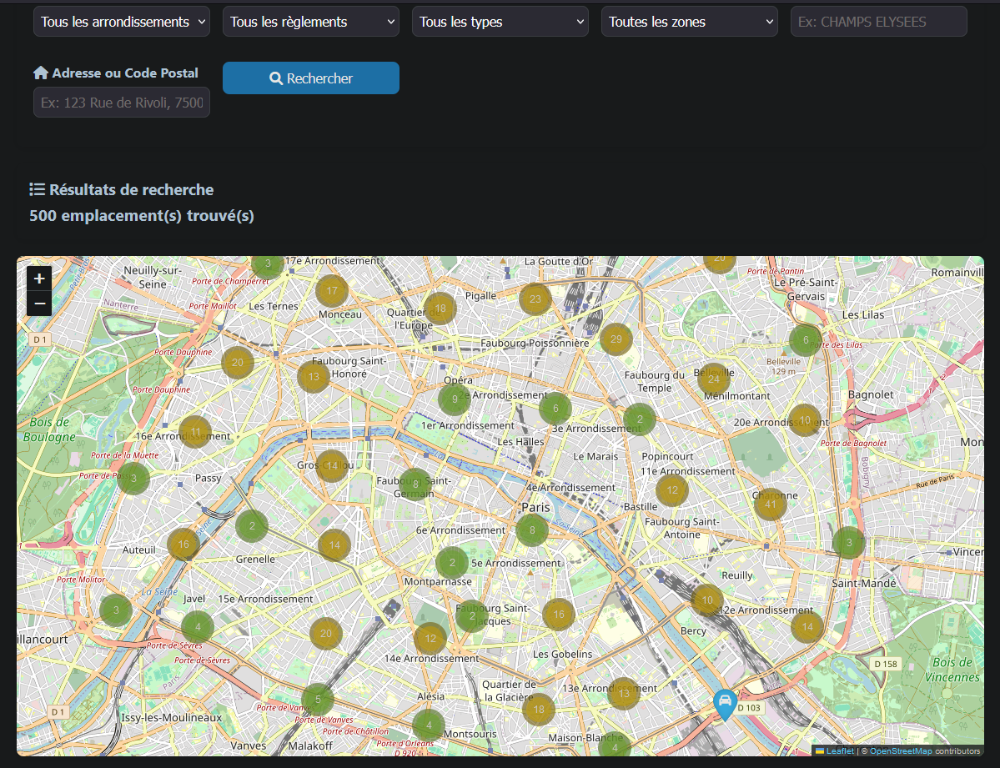
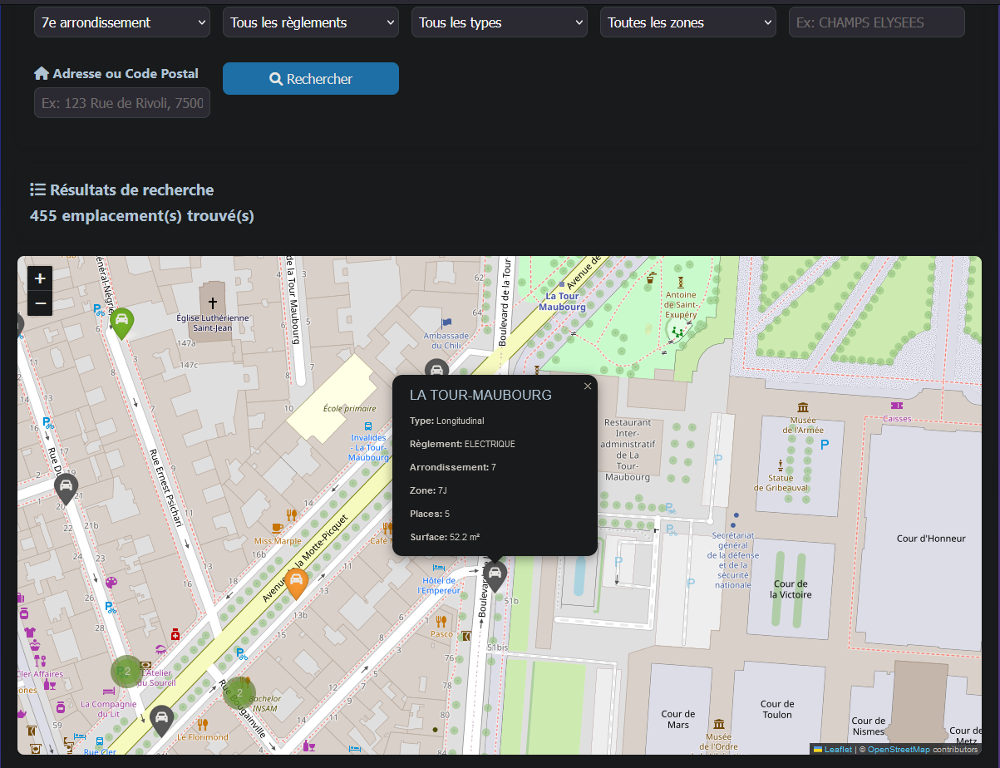

# ParkInParis

ParkInParis est une application web conçue pour aider les automobilistes à trouver des emplacements de stationnement à Paris en fonction de divers critères tels que l'arrondissement, le type de stationnement, et la proximité d'une adresse ou d'un code postal.\
L'application utilise des données ouvertes fournies par la ville de Paris pour offrir une solution de recherche de stationnement intuitive et efficace.

## Objectifs

- Faciliter la recherche de places de stationnement pour les automobilistes.
- Utiliser des données ouvertes pour offrir une solution précise et à jour.
- Fournir une interface utilisateur intuitive et facile à utiliser.

## Fonctionnalités

- Recherche d'emplacements de stationnement par arrondissement, type de règlement, type de stationnement, et zone.
- Recherche d'emplacements de stationnement par adresse ou code postal.
- Affichage des résultats sur une carte interactive.
- Filtrage dynamique des zones en fonction de l'arrondissement sélectionné.

## APIs Open Data Utilisées

### Stationnement sur voie publique - Emprises

**Description** : Cette API fournit des informations sur les emprises de stationnement sur la voie publique à Paris. Les emprises représentent les zones de stationnement définies par la ville.

Utiles pour afficher les "zones" sur une carte, avec leur réglementation (ex : "ici c’est livraison").

**URL** : [Stationnement sur voie publique - Emprises](https://opendata.iledefrance.fr/api/explore/v2.1/catalog/datasets/stationnement-sur-voie-publique-emprises/records)

### Stationnement sur voie publique - Emplacements

**Description** : Cette API fournit des informations sur les emplacements de stationnement sur la voie publique à Paris. Les emplacements représentent les places de stationnement individuelles disponibles dans les zones définies.

Utiles pour proposer une place la plus proche à un utilisateur

**URL** : [Stationnement sur voie publique - Emplacements](https://opendata.iledefrance.fr/api/explore/v2.1/catalog/datasets/stationnement-sur-voie-publique-emplacements/records)

## Prérequis

- Python 3.8 ou supérieur
- MongoDB
- Neo4j
- Flask
- Folium
- Geopy

## Chargez les données dans MongoDB et Neo4j :

```bash
# Il est conseillé de créer un cronjob pour charger les données dans MongoDB et Neo4j
# ou lancer les commandes suivantes manuellement pour mettre à jour les données.

python -m etl.load_to_mongo
python -m etl.load_to_neo4j
```

## Exécution

Pour exécuter l'application, utilisez la commande suivante :
```bash
python app.main
```

L'application sera accessible à l'adresse http://localhost:8080.

## Screenshots

<div style="display: flex; flex-direction: row;">
  
  
</div>

## Licence

Ce projet est sous licence MIT. Pour plus de détails, veuillez consulter le fichier [LICENSE](LICENSE).

## Auteurs

*mIcHy AmRaNe*
